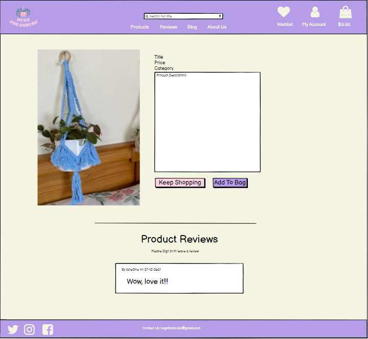
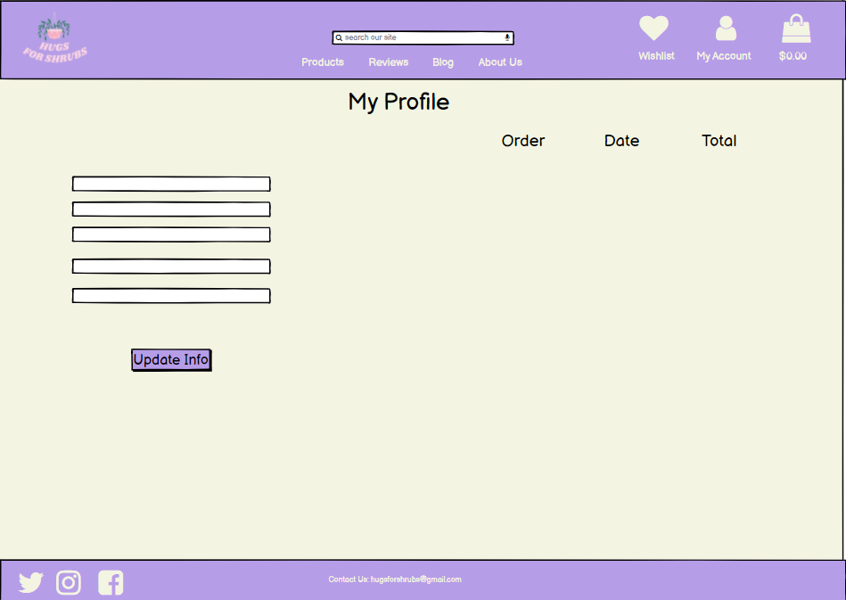
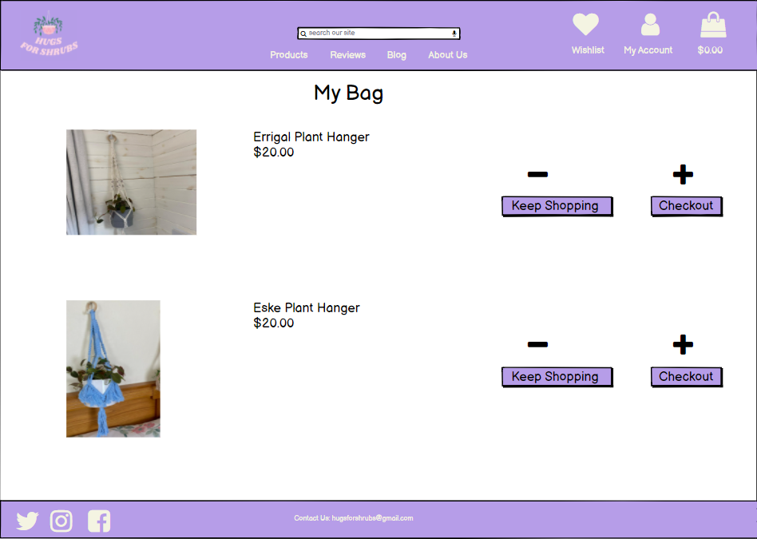

# HugsForShrubs

[Link to the Live Project](https://hugs-for-shrubs.herokuapp.com/)

HugsForShrubs has been built as the 4th milestone project as part of Code Institute's Full Stack Software Development course.
HugsForShrubs is a virtual 'E-commerce Website’ in which customers can purchase and browse Macrame plant hangers. It provides the user with a list of the various products available for purchase in the store. For the convenience of online shopping, a shopping cart is provided to the user. After the selection of the goods, it is sent to the order confirmation process for collection of payment. The system is implemented using Python’s web framework Django.

***

## UX 
### Project Goals
The scope of this project is to create a 'E-commerce website'. 
 
This is my 4th and final Milestone Project that must be developed as part of my Full Stack software development course with Code Institute.

The primary goal of the HugsForShrubs website is engage with visitors to the website and as a result sell the handcrafted macrame plant hangers products.

### User Stories

**As a first time visitor, I want to:**

1. Easily understand the main purpose of the website.
2. Navigate through the site with ease.
3. View a list of specific products of my choosing based on their category. So that I can select a particular category of product from a specific list to buy.
4. View the details of a single product. So that I can understand the details and price of the product and also see and image of the product.
5. Sort the view of products by price low to high. So that I can make an informed purchased based on price.
6. Sort the view of products by price high to low. So that I can make an informed purchased based on price.
7. Be easily able to register and create my own account so I can have a personalised experience.
8. Easily view the value of my shopping cart anywhere on the website. So that I can understand how much I have selected.
9. Easily view a summary of what's in my shopping cart, including all prices such as delivery and grand total price before I purchase. So that I can see how much I will be spending.
10. See all reviews for the products.
11. Check out and purchase my items without having to log in. So that I can conveniently purchase items quickly.
12. Have easy and quick access to the companies social media links.
13. Search for a specific product using keywords in a search bar.

**As a registered user, I want to:**
1. Login to my own account effortlessly so that I can access my profile to view my orders.
2. Logout of my account effortlessly to keep my details secure.
3. Easily recover my password if I forget it. So that I can recover my access to my profile.
4. Have a personalised profile so that I can view my order history.
5. Be able to update my payment and personal details if required.
6. Be able to leave a review of a product I've purchased.
7. Be able to create a blog post.

**As a superuser, I want to:**
1. Be able to add new products to the store easily.
2. Edit/update existing store products to change pricing, images and other criteria.
3. Delete items from the store.

## Development Planes

In order to design and create Hugs For Shrubs, I developer distinguished the required functionality of the site and how it would answer the user stories, as described above, using the **Five Development Planes**:

### <strong>1. <u>Strategy</u></strong>

The Hugs For Shrubs is an online e-commerce site with front-end and back-end functionality, developed using HTML, JavaScript, CSS, Python and Django. The main objective is to create a site delivers on the user stories outlined above.

### <strong>2. <u>Scope</u></strong>

The scope was created from using the Strategy previously defined. This allowed us to align the features to deliver on the strategy/ user stories. This was seperated into two categories:
- **Content Requirements**
     - The player will be looking for:
          - Dynamic and inviting visuals
          - Simple and vibrant content
          
 

- **Functionality Requirements**
     - The user will be able to:
          - Search with ease using a search bar
          - Log In to their own profile
          - Make payments with ease
          - Access to all products
          - Register for profile
          - Get contact details for owner

### <strong>3. <u>Structure</u></strong>

#### Allauth features
The sign up, register, password reset, email confirmation pages etc, have all been provided by Django allauth and formatted to suit the needs of the site.

#### Admin Features
  - Admin will have access to additional features across the site. Firstly admin members will have an additional icon in the delivery banner (on larger devices) or link in the burger menu (on smaller devices) to take the user to the site admin page. Here the admin user will have access to:
    - Add a product page link - This will take the admin user to the add product page. Here the user can fill in the form to add a product to the site. Once added the admin user will be taken to the product detail page for the product added.
    - On the product page and product detail page admin users will have access to the edit and delete products. The edit icon will take the user to the edit product form, where they can make changes to a product (i.e chnage the price). The delete icon will trigger a modal to make sure the user wishes to delete the product and avoid accidental deletions.

#### Base Template
* Delivery Banner - The delivery banner contains information about free delivery and the free delivery threshold. It is fixed to the top of the screen to allow for ease of access and improved user navigation. The links take users to different parts of the site which are as follows:
 - Unregistered user:
   - Login link
   - Register link
 - Registered user:
   - Saved Items
   - My Account - Profile, Logout
   - Shopping Bag
   - Wishlist
 - Admin/ superuser
   - Product Management

#### Navbar
The navbar has all product category links,
- All Products - here products may be sorted and selected based on price, name, rating or category
- Errigal - Errigal type plant hangers
- Eske - Eske Type plant hangers 

#### Footer
The footer has the links to the social media links.

#### Homepage
The home page has the navigation links, logo, hero image, call to action button, product categories and the footer.
#### About Me
The about page gives the user a short background on Hugs For Shrubs. This will also contain a contact form and a submit button.
The user will see an alert on the screen confirming the message has been sent.
#### Product page
The product page displays all products in the store.
The sorting range button is also displayed here to allow the users sort products based on price, name and category.
#### Blog page
The blog page will give registered users a chance to creat their own blog posts. The admin will have the power to delete these if they are not deemed
appropriate.
#### Product detail page
   The product details page includes, name of the product, price , category, rating and product description.
   There are also two button links one to keep shopping that leads to the all products page and the other add to bag button that adds the product to the user's shopping bag.
   Admin/ superuser has two links to delete or edit product. Reviews for each product will be visible at the bottom of the page.
#### Toasts 
  - Toast message boxes have been used through out the site to display the feedback to the user when they have made interactions with the site. These messages are color coded to transmit different kinds of information:
    - Green: Success
    - Red : Errors
    - Blue : Information
    - Yellow : Warning
#### Shopping Bag  page
  The shopping bag page can be broken into 5 parts for each product added to their cart:
  - Product - which displays an image of the product the user has added to their bag.
  - Product info - displays the name of the product and product sku. 
  - Price - displays the individual product price.
  - Quantity - Users are able to update their order using the quantity selectors and the update button. Users can also remove that product from their shopping cart entirely by clicking the remove button.
  - Subtotal - displays the subtotal for each product (product price * quantity).
Underneath the products that are in the user's cart, there is information for cart total, delivery and grand total. If a user does not meet the free delivery threshold a helpful message will be displayed to let them know what they need to spend in order to qualify for free delivery.
  - There is a button to take the users back to the all product page, and a "Secure Checkout" button to take the user to the checkout page.
  - If the user has no items in the shopping cart, a message is displayed to the user to let them know this and a button to take the user to the all products page is displayed.
#### Checkout page
The Checkout page is split into two columns on larger devices, and 2 rows on smaller devices:
 - Order Summary - Gives a nice overview of each of the products that they are purchasing. Users can also see a breakdown of the order total, delivery and grand total.
 - Checkout Form - split into 3 sections:
   - Details - where users are invited to fill out their full name and email address. Email address will be auto populated if a user has logged in and saved this information to their profile.
   - Delivery - Users can fill in where they wish their products to be delivered to. These fields will be auto populated if a user has logged in and saved this information to their profile.
   - Payment - Users can enter their card details here in order to make payments and purchase their chosen products.
 - Below the checkout form, users can click the "Adjust bag" button to make adjustments to their shopping bag, or click the "Complete Order" button to make their purchases. Users are informed exactly how much they will be charged with a helpful message directly underneath the "Complete Order" button.
 #### Checkout success page
 - When a user successfully checks out a success toast will be shown to the user with the order number and a confirmation email will be sent to the user with some of the details of their order.
 - The checkout success page itself is split into two sections:
   - Order information which details the order info, delivery details and billing info.
   - Order Summary - Gives a nice overview of each of the products that they are purchasing.
 - More products link which will take the user back to the all products page encouraging the user to make more purchases.

 #### Profile page
   - Here users can update their default information by filling in the form and clicking update info button allowing them to make quick purchases at checkout.
   - Regarding information aboutuser's past orders, users can click the order number to take them to the checkout success page .
 #### Saved Items
  - The wishlists app allows signed-in users to create a list of saved Items. A user can add a product to their wishlist from the product detail page and manage their lists in the account section.
  - When the used has added products to their wishlist ; they will be displayed here in the same format as the products page.

 

## <strong>4. <u>Skeleton</u></strong>

Wireframes and  Mockups were created in a Balsamiq Workspace with providing a positive user experience in mind:

### Wireframes

  
Home

  

  
About 

  

  
All products 

  

  
Product Details 

  

  
Blog 

  

  
Login 

  

  
Register 

  

  
Profile 

  

  
Add product(Admin) 

  

  
Checkout 

  

  
Checkout Success

  

  
Bag

  

 ---   
### Mockups

  
Home

  

  
About 

  

  
All products 

  

  
Product Details 

  

  
Blog 

  

  
Login 

  

  
Register 

  

  
Profile 

  

  
Add product(Admin) 

  

  
Checkout 

  

  
Checkout Success

  

  
Bag

  

 

## <strong>5. <u>Surface</u></strong>

- <strong>Colour Scheme</strong>

    

    
Palette

    
    

     - I used the palette maker from the Coolors website to choose my color scheme.

     - The chosen colour scheme was specifically selected in order to define the tone of the website.

     - A General palette was created, with a vibrant engaging atmosphere in mind, and was used in designing graphics and complimentary text colour:
     
    

- <strong>Typography</strong>

     - The primary font chosen is [Cardo](https://fonts.google.com/specimen/Cardo?query=cardo). A sans-serif typeface, Lato is geometrically shaped and is easily readable.

     - The charismatic combination of the typefaces compliments the clean aesthetic and entertaining theme set by the colour palette.

[Back to top ⇧](#table-of-contents)

## Features left to implement

**With more time I would have liked to implement the following and they may be implemented in the future.**

- Allow users to like/comment on blogs post.
- Allow users to like/comment on reviews.
- Add video to blog posts.
- Add feature to display most liked, most commented on blogs.
- Give users the ability to rate the products.
- Add favourites functionality.
- Add a wishlist.
- Profile notifications when theres a comment/like on a post or review on a product
- Share on social media
- Log in with social media
- Adding a points system where repeat buyers can accumulate points and use those points for discounts.
- Add pagination to products page.
- Have a product total amount so a product can be listed as 'currently sold out'.

## Database Schema

## Technologies Used

- [HTML](https://developer.mozilla.org/en-US/docs/Web/HTML)
- [CSS](https://developer.mozilla.org/en-US/docs/Learn/CSS/First_steps/What_is_CSS)
- [JavaScript](https://www.javascript.com/)
- [Python](https://www.python.org/)
- [Pip3](https://pip.pypa.io/en/stable/)- install packages to python
- [Git](https://git-scm.com/)- version control
- [GitHub](https://github.com/)- host project files
- [Gitpod](https://www.gitpod.io/)- coding enviroment
- [Django](https://www.djangoproject.com/)- main framework for project
- [Heroku](https://id.heroku.com/login)- cloud platform
- [Django Crispy forms](https://django-crispy-forms.readthedocs.io/en/latest/)- displays forms
- [Stripe](https://stripe.com/gb) - used as secure payement system
- [AWS](https://aws.amazon.com/) - Used to store static files
- [Bootstrap](https://getbootstrap.com/) - Used for responsiveness
- [Font Awesome](https://fontawesome.com/) - Used for icons such as footer
- [Balsamiq](https://balsamiq.com/) - Used for mockups ad wireframes

[Back to top ⇧](#table-of-contents)

## Testing

Testing section is located here [testing.md file](/testing.md)

## Deployment

### Live Website Link
[HugsForShrubs live site](https://hugs-for-shrubs.herokuapp.com/)

### Repository Link
[github link](https://github.com/SamBurgess93/hugsforshrubs)

### Running Code Locally

To deploy the project the following is required:-

- Github account
- Heroku Account
- AWS Account

To create a clone follow the below steps:- 

Github
1. Login to github and find the repository.
2. Click Code and open with Github Desktop.
3. Follow the prompts in the GitHub Desktop Application.

Heroku Deployment with AWS

1. Install gunicorn, psycopg2-binary and dj-database-url using the PIP Install command.
2. Freeze all the requirements for the project into a requirements.txt file using the pip3 freeze > requirements.txt command.
3. Create a procfile, with the following inside it: web: gunicorn pjc_plant_services_ms4.wsgi:application
4. Push these changes to GitHub, using git add . git commit -m and git push commands.
5. Navigate to [Heroku](https://www.heroku.com/), and login or create an account.
6. Once logged in, click on 'resources'.
7. From the add-ons search bar, add the Heroku Postgres DB, select the free account, and then submit order form to add it to the project.
8. From the app's dashboard, click on 'settings', and then 'reveal config vars' in order to set the necessary configuration variables for the project. 
It should look like this: 

| Key                   | Value                      |
|-----------------------|----------------------------|
| AWS_ACCESS_KEY_ID     | Your AWS Access Key        |
| AWS_SECRET_ACCESS_KEY | Your AWS Secret Access Key |
| DATABASE_URL          | Your Database URL          |
| EMAIL_HOST_PASS       | Your Email Password        |
| EMAIL_HOST_USER       | Your Email Address         |
| SECRET_KEY            | Your Secret Key            |
| STRIPE_PUBLIC_KEY     | Your Stripe Public Key     |
| STRIPE_SECRET_KEY     | Your Stripe Secret Key     |
| STRIPE_WH_SECRET      | Your Stripe WH Key         |
| USE_AWS               | TRUE                       |

9. Back on the main dashboard, click on 'deploy', and then under the 'Deployment' method section, select GitHub and 'Automatic Deploys'.

10. Ensure that in settings.py, the following code is commented out:

Database
 https://docs.djangoproject.com/en/3.1/ref/settings/#databases

and the following code is added:

DATABASES = {
        'default': dj_database_url.parse(os.environ.get('DATABASE_URL'))
    }
11. Make migrations using the following command:
python3 manage.py makemigrations
and migrate the database models to the Postgres database using the following command:
python3 manage.py migrate

12. New products can be entered via the Django Admin panel or the SQLLite Database can be imported by using the following command
python3 manage.py loaddata

13. Create a new superuser with the following command:
python3 manage.py createsuperuser
and then enter chosen email, username and password.

14. In settings.py, contain the previously entered database setting in an if statement, and add an else condition, so that different databases are 
used depending on the environment.

if 'DATABASE_URL' in os.environ:
    DATABASES = {
        'default': dj_database_url.parse(os.environ.get('DATABASE_URL'))
    }
else:
    DATABASES = {
        'default': {
            'ENGINE': 'django.db.backends.sqlite3',
            'NAME': BASE_DIR / 'db.sqlite3',
        }
    }

15. Disable 'COLLECTSTATIC' with the fillowing code: heroku config:set DISABLE_COLLECTSTATIC=1
so that Heroku doesn't attempt to collect the static files.
16. Add ALLOWED_HOSTS = ['fashionista2.herokuapp.com', 'localhost', '8000'] to settings.py.
17. Add Stripe environment variables to settings.py.
18. Push to Heroku using the following command:
    git push heroku main

Amazon Web Services:

All Static and media files for the deployed version of the site are hosted in a Amazon Web Services(AWS) S3 bucket. 
In order to create your own bucket, please follow the instructions on the AWS website 
[Here](https://docs.aws.amazon.com/AmazonS3/latest/userguide/creating-bucket.html)

1. In the gitpod terminal, install boto3 and django-storages using the following commands:
   pip3 install boto3 and pip3 install django-storages
2. Freeze the new requirements into the 'requirements.txt' file using the pip3 freeze > requirements.txt command
3. Add 'storages' to INSTALLED_APPS in settings.py.
4. Add the following code to settings.py in order to link the AWS bucket to the website:

if 'USE_AWS' in os.environ:
    # Cache control
    AWS_S3_OBJECT_PARAMETERS = {
        'Expires': 'Thu, 31 Dec 2099 20:00:00 GMT',
        'CacheControl': 'max-age=94608000',
    }

    # Bucket Config
    AWS_STORAGE_BUCKET_NAME = 'fashionista2'
    AWS_S3_REGION_NAME = 'eu-central-1'
    AWS_ACCESS_KEY_ID = os.environ.get('AWS_ACCESS_KEY_ID')
    AWS_SECRET_ACCESS_KEY = os.environ.get('AWS_SECRET_ACCESS_KEY')
    AWS_S3_CUSTOM_DOMAIN = f'{AWS_STORAGE_BUCKET_NAME}.s3.amazonaws.com'

    # Static and media files
    STATICFILES_STORAGE = 'custom_storages.StaticStorage'
    STATICFILES_LOCATION = 'static'
    DEFAULT_FILE_STORAGE = 'custom_storages.MediaStorage'
    MEDIAFILES_LOCATION = 'media'

    # Override static and media URLs in production
    STATIC_URL = f'https://{AWS_S3_CUSTOM_DOMAIN}/{STATICFILES_LOCATION}/'
    MEDIA_URL = f'https://{AWS_S3_CUSTOM_DOMAIN}/{MEDIAFILES_LOCATION}/'

5. Create a custom_storages.py file in the root level of the project. Inside it, include the locations of the Static Storage and Media Storage.
6. Delete DISABLE_COLLECTSTATIC from the Heroku Config Variables.
7. Finally, push to GitHub, and all changes should be automatically pushed to Heroku too.

Making a Local Clone:
In order to make a local clone of the fashionista website, enter git clone https://github.com/SamBurgess93/hugsforshrubs into the terminal. 

Next, create an .env.py file in the root directory of the project, and add it to the .gitignore file. 
The following code needs to be added to the .env.py file:

import os  
os.environ["DEVELOPMENT"] = "True"    
os.environ["SECRET_KEY"] = "<Your Secret Key>"
os.environ["STRIPE_PUBLIC_KEY"] = "<Your Stripe Public Key>"    
os.environ["STRIPE_SECRET_KEY"] = "<Your Stripe Secret Key>"    
os.environ["STRIPE_WH_SECRET"] = "<Your Stripe WH Secret Key>"   

Then make sure that the required packages are installed by running the following command: 
pip install -r requirements.txt

Make migrations and then migrate in order to create a database, by running the following commands:
python3 manage.py makemigrations and python3 manage.py migrate.

New products can be entered via the Django Admin panel or the SQLLite Database can be imported by using the following command
python3 manage.py loaddata

Create a superuser with the following command: python3 manage.py createsuperuser and entering your email, username and password.

Run the app by entering the following command:
python3 manage.py runserver

[Back to top ⇧](#table-of-contents)

## Credits 

### Images
### Code 
I consulted the following sites to better understand some elements of code:
- [Stack Overflow](https://stackoverflow.com/ "Link to Stack Overflow page")
- [W3Schools](https://www.w3schools.com/ "Link to W3Schools page")
- [Bootstrap](https://getbootstrap.com/ "Link to BootStrap page")

## Acknowledgements

- I would like to thank my friends and family for their time and opinions on the website.
- I would like to thank my mentor, Seun, for her help and constructive feedback throughout the project.
- I would like to thank the tutors for their guidance on issues throughout the project.
- I would like to thank my girlfriend Orla for her constant support and opinions throughout.

[Back to top ⇧](#table-of-contents)
