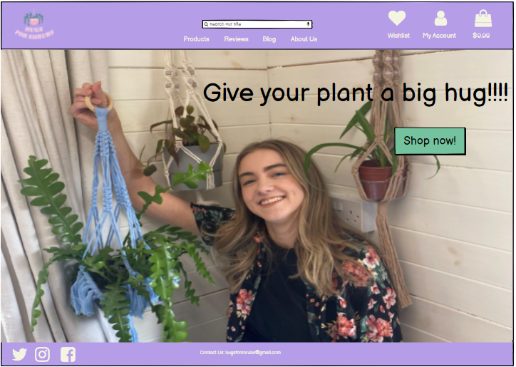
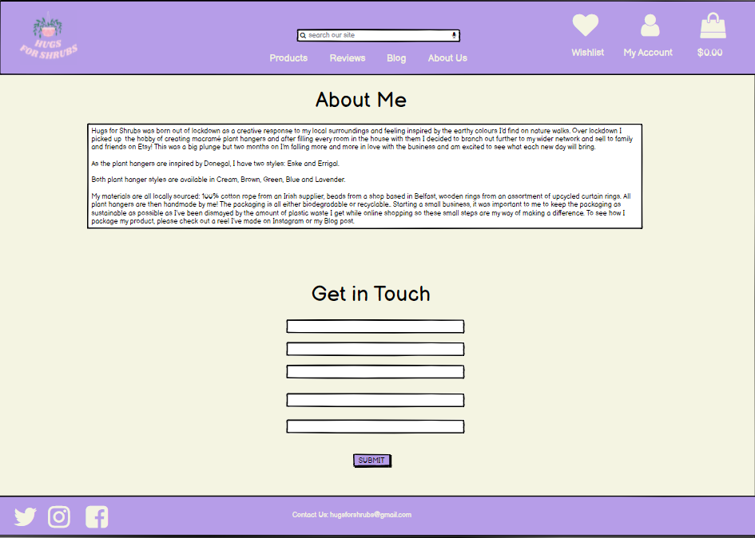
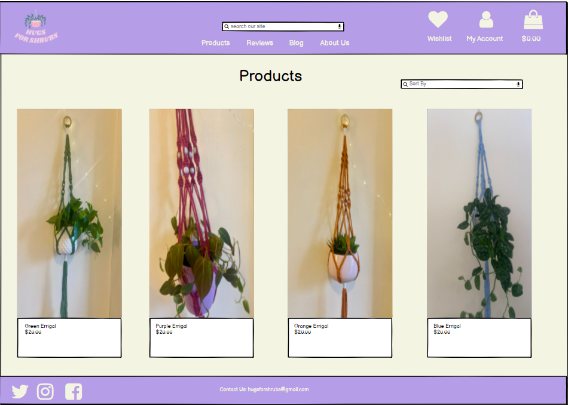
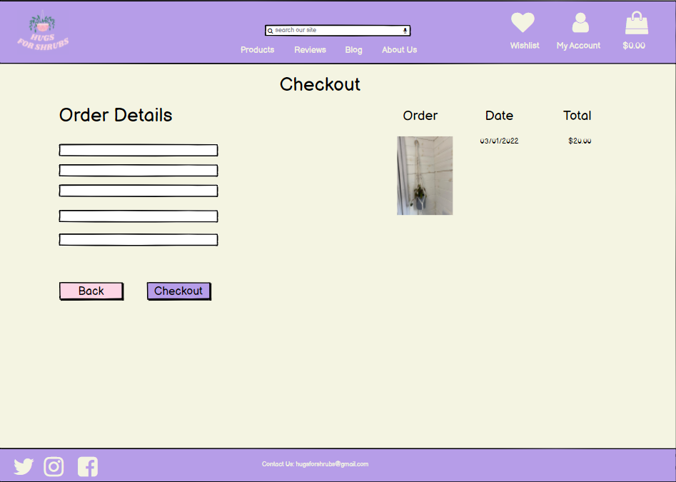

# HugsForShrubs

[Link to the Live Project](???).

HugsForShrubs has been built as the 4th milestone project as part of Code Institute's Full Stack Software Development course.
HugsForShrubs is a virtual 'E-commerce Website’ in whcih customers can purchase and browse Macrame plant hangers. It provides the user with a list of the various products available for purchase in the store. For the convenience of online shopping, a shopping cart is provided to the user. After the selection of the goods, it is sent to the order confirmation process for collection of payment. The system is implemented using Python’s web framework Django.

## Table of contents
1. [UX](#ux)
    1. [Project Goals](#project-goals)
    2. [User Stories](#user-stories)
    3. [Development Planes](#development-planes)
    4. [Changes Made During Project Development](#changes-made-during-project-development)
2. [Technologies Used](#technologies-used)
     1. [Languages and Frameworks](#languages-and-frameworks)
     2. [Applications](#applications)
3. [Testing](#testing)
4. [Deployment](#deployment)
     1. [To contribute to the project](#to-contribute-to-the-project)
     2. [Deploying to Heroku](#deploying-to-heroku)
     3. [Heroku App Creation](#heroku-app-creation)
5. [Credits](#credits)
     1. [Images](#images)
     2. [Code](#code)
6. [Acknowledgements](#acknowledgements)
***

## UX 
### Project Goals
The scope of this project is to create a 'E-commerce website'. 
 
This is my 4th and final Milestone Project that must be developed as part of my Full Stack software development course with Code Institute.

The primary goal of the HugsForShrubs website is engage with visitors to the website and as a result sell the handcrafted macrame plant hangers products.

### User Stories

**As a first time visitor, I want to:**

1. Easily understand the main purpose of the website.
2. Navigate through the site with ease.
3. View a list of specific products of my choosing based on their category. So that I can select a particular category of product from a specific list to buy.
4. View the details of a single product. So that I can understand the details and price of the product and also see and image of the product.
5. Sort the view of products by price low to high. So that I can make an informed purchased based on price.
6. Sort the view of products by price high to low. So that I can make an informed purchased based on price.
7. Be easily able to register and create my own account so I can have a personalised experience.
8. Receive an verification email to verify that my account was set up.
9. Easily view the value of my shopping cart anywhere on the website. So that I can understand how much I have selected.
10. Easily view a summary of what's in my shopping cart, including all prices such as delivery and grand total price before I purchase. So that I can see how much I will be spending.
11. See all reviews for the products.
12. Check out and purchase my items without having to log in. So that I can conveniently purchase items quickly.
13. Easily view the contact details for the company. So I can contact Hugs For Shrubs about my orders or requirements.
14. Have easy and quick access to the companies social media links.
15. Search for a specific product using keywords in a search bar.

**As a registered user, I want to:**
1. Login to my own account effortlessly so that I can access my profile to view my orders.
2. Logout of my account effortlessly to keep my details secure.
3. Easily recover my password if I forget it. So that I can recover my access to my profile.
4. Have a personalised profile so that I can view my order history.
5. View my order history, order confirmations, and saved payment information in my profile.
6. Be able to update my payment and personal details if required.

**As a superuser, I want to:**
1. Be able to add new products to the store easily.
2. Edit/update existing store products to change pricing, images and other criteria.
3. Delete items from the store.

### Development Planes

In order to design and create Hugs For Shrubs, I developer distinguished the required functionality of the site and how it would answer the user stories, as described above, using the **Five Development Planes**:

<strong>1. <u>Strategy</u></strong>

The Hugs For Shrubs is an online e-commerce site with front-end and back-end functionality, developed using HTML, JavaScript, CSS, Python and Django. The main objective is to create a site delivers on the user stories outlined above.

<strong>2. <u>Scope</u></strong>

The scope was created from using the Strategy previously defined. This allowed us to align the features to deliver on the strategy/ user stories. This was seperated into two categories:
- **Content Requirements**
     - The player will be looking for:
          - Dynamic and inviting visuals
          - Simple and vibrant content
          

- **Functionality Requirements**
     - The user will be able to:
          - Search with ease using a search bar
          - Log In to their own profile
          - Make payments with ease
          - Access to all products
          - Register for profile
          - Get contact details for owner

<strong>3. <u>Structure</u></strong>

### Allauth features
The sign up, register, password reset, email confirmation pages etc, have all been provided by Django allauth and formatted to suit the needs of the site.

#### Admin Features
  - Admin will have access to additional features across the site. Firstly admin members will have an additional icon in the delivery banner (on larger devices) or link in the burger menu (on smaller devices) to take the user to the site admin page. Here the admin user will have access to:
    - Add a product page link - This will take the admin user to the add product page. Here the user can fill in the form to add a product to the site. Once added the admin user will be taken to the product detail page for the product added.
    - On the product page and product detail page admin users will have access to the edit and delete products. The edit icon will take the user to the edit product form, where they can make changes to a product (i.e chnage the price). The delete icon will trigger a modal to make sure the user wishes to delete the product and avoid accidental deletions.

### Base Template
* Delivery Banner - The delivery banner contains information about free delivery and the free delivery threshold. It is fixed to the top of the screen to allow for ease of access and improved user navigation. The links take users to different parts of the site which are as follows:
 - Unregistered user:
   - Login link
   - Register link
 - Registered user:
   - Saved Items
   - My Account - Profile, Logout
   - Shopping Bag
 - Admin/ superuser
   - Wishlist
   - My Account - Product Management, Profile, Logout

### Navbar
The navbar has all product category links,
- All Products - here products may be sorted and selected based on price, name, rating or category
- Errigal - Errigal type plant hangers
- Eske - Eske Type plant hangers 

### Footer
The footer has the links to the social media links and contains the contact email information.

### Homepage
The home page has the navigation links, logo, hero image, call to action button, product categories and the footer.
### About Me
The about page gives the user information on the company and owner. This will have an image.
### Product page
The product page displays all products in the store.
The sorting range button is also displayed here to allow the users sort products based on price, name and category.
### Product detail page
   The product details page includes, name of the product, price , category, rating and product description.
   There are also two button links one to keep shopping that leads to the all products page and the other add to bag button that adds the product to the user's shopping bag.
   Admin/ superuser has two links to delete or edit product .
### Toasts 
  - Toast message boxes have been used through out the site to display the feedback to the user when they have made interactions with the site. These messages are color coded to transmit different kinds of information:
    - Green: Success
    - Red : Errors
    - Blue : Information
    - Yellow : Warning
### Shopping Bag  page
  The shopping bag page can be broken into 5 parts for each product added to their cart:
  - Product - which displays an image of the product the user has added to their bag.
  - Product info - displays the name of the product and product sku. 
  - Price - displays the individual product price.
  - Quantity - Users are able to update their order using the quantity selectors and the update button. Users can also remove that product from their shopping cart entirely by clicking the remove button.
  - Subtotal - displays the subtotal for each product (product price * quantity).
Underneath the products that are in the user's cart, there is information for cart total, delivery and grand total. If a user does not meet the free delivery threshold a helpful message will be displayed to let them know what they need to spend in order to qualify for free delivery.
  - There is a button to take the users back to the all product page, and a "Secure Checkout" button to take the user to the checkout page.
  - If the user has no items in the shopping cart, a message is displayed to the user to let them know this and a button to take the user to the all products page is displayed.
### Checkout page
The Checkout page is split into two columns on larger devices, and 2 rows on smaller devices:
 - Order Summary - Gives a nice overview of each of the products that they are purchasing. Users can also see a breakdown of the order total, delivery and grand total.
 - Checkout Form - split into 3 sections:
   - Details - where users are invited to fill out their full name and email address. Email address will be auto populated if a user has logged in and saved this information to their profile.
   - Delivery - Users can fill in where they wish their products to be delivered to. These fields will be auto populated if a user has logged in and saved this information to their profile.
   - Payment - Users can enter their card details here in order to make payments and purchase their chosen products.
 - Below the checkout form, users can click the "Adjust bag" button to make adjustments to their shopping bag, or click the "Complete Order" button to make their purchases. Users are informed exactly how much they will be charged with a helpful message directly underneath the "Complete Order" button.
 ### Checkout success page
 - When a user successfully checks out a success toast will be shown to the user with the order number and a confirmation email will be sent to the user with some of the details of their order.
 - The checkout success page itself is split into two sections:
   - Order information which details the order info, delivery details and billing info.
   - Order Summary - Gives a nice overview of each of the products that they are purchasing.
 - More products link which will take the user back to the all products page encouraging the user to make more purchases.

 ### Profile page
   - Here users can update their default information by filling in the form and clicking update info button allowing them to make quick purchases at checkout.
   - Regarding information aboutuser's past orders, users can click the order number to take them to the checkout success page .
 ### Saved Items
  - The wishlists app allows signed-in users to create a list of saved Items. A user can add a product to their wishlist from the product detail page and manage their lists in the account section.
  - When the used has added products to their wishlist ; they will be displayed here in the same format as the products page.

### Features left to implement

<strong>4. <u>Skeleton</u></strong>

Wireframes and  Mockups were created in a Balsamiq Workspace with providing a positive user experience in mind:

## Wireframes

  
Home

  

  
About 

  

  
All products 

  

  
Product Details 

  

  
Login 

  

  
Register 

  

  
Profile 

  

  
Add product(Admin) 

  

  
Checkout 

  

  
Checkout Success

  

  
Bag

  

 ---   
## Mockups

  
Home

  

  
About 

  

  
All products 

  

  
Product Details 

  

  
Login 

  

  
Register 

  

  
Profile 

  

  
Add product(Admin) 

  

  
Checkout 

  

  
Checkout Success

  

  
Bag

  

<strong>5. <u>Surface</u></strong>

- <strong>Colour Scheme</strong>

    

    
Palette

    
    

     - I used the palette maker from the Coolors website to choose my color scheme.

     - The chosen colour scheme was specifically selected in order to define the tone of the website.

     - A General palette was created, with a vibrant engaging atmosphere in mind, and was used in designing graphics and complimentary text colour:
     
    

- <strong>Typography</strong>

     - The primary font chosen is [Cardo](https://fonts.google.com/specimen/Cardo?query=cardo). A sans-serif typeface, Lato is geometrically shaped and is easily readable.

     - The charismatic combination of the typefaces compliments the clean aesthetic and entertaining theme set by the colour palette.

[Back to top ⇧](#table-of-contents)

## Technologies Used

- [HTML](https://developer.mozilla.org/en-US/docs/Web/HTML)
- [CSS](https://developer.mozilla.org/en-US/docs/Learn/CSS/First_steps/What_is_CSS)
- [JavaScript](https://www.javascript.com/)
- [Python](https://www.python.org/)
- [Pip3](https://pip.pypa.io/en/stable/)- install packages to python
- [Git](https://git-scm.com/)- version control
- [GitHub](https://github.com/)- host project files
- [Gitpod](https://www.gitpod.io/)- coding enviroment
- [Django](https://www.djangoproject.com/)- main framework for project
- [Heroku](https://id.heroku.com/login)- cloud platform
- [Django Crispy forms](https://django-crispy-forms.readthedocs.io/en/latest/)- displays forms
- [Stripe](https://stripe.com/gb) - used as secure payement system
- [AWS](https://aws.amazon.com/) - Used to store static files
- [Bootstrap](https://getbootstrap.com/) - Used for responsiveness
- [Font Awesome](https://fontawesome.com/) - Used for icons such as footer
- [Balsamiq](https://balsamiq.com/) - Used for mockups ad wireframes

## Deployment

### To contribute to the project

- Navigate to the Owery Joinery repository page in GitHub https://github.com/PaulWheatcroft/owery-joinery
- In the top right corner click Fork
- This creates a copy in your GitHub repository
- From here you could open in Gitpod or make changes directly in GitHub. Once completed click New Push Request to submit your changes to be merged with the master branch

### Clone and Run Locally

You can find the clone string for the repository in Code button above the project’s files. Most IDE applications have a GUI interface for cloning a GitHub repository from this string.

Alternatively the repository can be cloned from the terminal of your IDE
- Open the terminal
- Change the current working directory to the location where you want the cloned directory
- Type git clone, and then paste the URL you copied earlier. git clone https://github.com/YOUR-USERNAME/YOUR-REPOSITORY
- Press Enter to create the local clone
Once the clone has completed (through either method) you should see a requirements.txt file in the route of the directory.
- In the terminal run pip install -r requirements.txt

The inbuilt Django sqlite3 database will run as a default until you reconfigure this once deployed to Heroku.

It’s advisable to set up the DJANGO_SECRET_KEY as an environment variable rather than leave it exposed in settings.py.

### Stripe

You will need to configure your payment service provider. This project has been set up using Stripe and that will have installed as part of requirements.txt. This project has used the following environment variables to store the keys necessary to run Stripe and make use of their webhook capability. Further documentation of

To set up an account got to https://stripe.com/
- Click start now
- Create your stripe account
- Log in and click on Developers
- Click on API Keys
- •Create two following variables both in settings.py and the same two variable names in your environment variables.
    - STRIPE_PUBLIC_KEY
    - STRIPE_SECRET_KEY
- Store the Stripe Publishable key in STRIPE_PUBLIC_KEY in the environment variables and link this to your variable in settings.py: STRIPE_PUBLIC_KEY = os.getenv('STRIPE_PUBLIC_KEY', '') While strictly speaking this isn’t necessary as the key is public it’s still good practice.
- Store the Stripe Secret key in STRIPE_SECRET_KEY in the environment variables and link this to your variable in settings.py: STRIPE_SECRET_KEY = os.getenv('STRIPE_SECRET_KEY', '')
- Now click on Webhooks in Stripe
- Click Add an endpoint
- When you have configured the endpoint get the Signing secret and store this in another variable STRIPE_WH_SECRET. Again create an environment variable to store the key and link this to the variable in settings.py: STRIPE_WH_SECRET = os.getenv('STRIPE_WH_SECRET', '')

The application has been configured for the UK market. Also in settings.py add the following STRIPE_CURRENCY = 'gbp'

At this point content delivery does not need to be configured as this will be served locally through the standard Django file structure.
You should now be able to run the website from your local environment.

### Deploying to Heroku

- To deploy to Heroku https://www.heroku.com/
- Log in with your account
- Select New
- Then Create new app
- Give your app a unique name and choose your local region
- Then click Create app

Once created for the following steps you will need to have access to Settings and to Reveal Config Vars section of your app

### Postgres

This project has been configured using the Heroku Postgres add-on. If you plan on also using this add-on…
- Go to the resources tab in Heroku.
- In the Add-ons search bar look for Heroku Postgres and then click on it to select it
- Choose the Hobby Dev-Free option in plans.
- Click submit order form.

By clicking on the add-on when displayed on the Resources page you will be taken to the datastores page for the database. Click on settings then View Credentials to get the URI path that will be added to the DATABASE_URL variable (see below

### AWS S3 Bucket

An AWS S3 Bucket is used to store the projects static files. Because of how Django works you will also need to configure external storage when deploying to Heroku. To use AWS
- Sign up for an AWS account at https://portal.aws.amazon.com/
- Unless otherwise set this up as a personal account
- Navigate to the AWS Management Console as Root user
- Search and click on S3
- Create a bucket
- Give your bucket a name and choose a region based on your geographical requirements
- Uncheck Block all public access to enable public access
- Acknowledge the current settings
- Click to create the bucket
- Open the bucket you created
- Select Properties tab and turn on static website hosting (bottom of the page)
    - Edit
    - Enable
    - Set Index document to index.html
    - Set Error document to error.html
    - Save changes
- Copy the Amazon Resource Name (ARN)
- Click on the Permissions tab and navigate to Cross-origin resource sharing (CORS) and add the following
[
    {
        "AllowedHeaders": [
            "Authorization"
        ],
        "AllowedMethods": [
            "GET"
        ],
        "AllowedOrigins": [
            "*"
        ],
        "ExposeHeaders": []
    }
]
- In the Bucket Policy click Edit then Policy Generator
    - This open a separate window
- Step 1: is S3 Bucket Policy
- Step 2: add the following settings:
    - Effect: Allow
    - Principal: *
    - Actions: GetObject
    - ARN: The Amazon Resource Name (ARN)
- Click on Add Statement.
- Click on Generate Policy
- Copy the policy from the popup that appears
- Paste the generated policy into the Bucket Policy
- Add '/*' at the end of the Resource key, and save.
- Navigate to the Access control list (ACL) and select List next to Everyone

### AWS IAM

- Search and click on IAM
- Staring on the left of the screen navigate to User Groups
- Create group
- Give your group a name and click create group
- Again on the left of the navigate Policies
    - Create New Policy
    - JSON tab
    - Import Managed Policy and search for S3
    - Select AmazonS3FullAccess and click Import
- Within "Resource" replace * with your [ARN address and ARN address/]
"Resource": [
    "ARN",
    "ARN/*"
]

- Click Next: Tags
- Click Next: Review and provide a name
- Click create policy
- Back on the left-hand side go to User Groups
    - Open your group
    - Permissions
    - Add Permissions
    - Attach Policies
    - Search for your policy and add it
- Back on the left-hand side click Users
    - Add user
    - Add a user name
    - Select Access key - Programmatic access
    - Click Next
    - Select your user group
    - Click Next: Tags then Next: Review then Create User
    - IMPORTANT THIS IS THE ONLY TIME YOU CAN COMPLETE THIS STEP. Download tHE Download.CSV which contains the information you need for the variables AWS_ACCESS_KEY_ID and AWS_SECRET_ACCESS_KEY. Create both of these environment variables.
You can now configure the following in settings.py
AWS_STORAGE_BUCKET_NAME = 'your bucket name'
AWS_S3_REGION_NAME = ‘your region’
AWS_ACCESS_KEY_ID = os.environ.get('AWS_ACCESS_KEY_ID')
AWS_SECRET_ACCESS_KEY = os.environ.get('AWS_SECRET_ACCESS_KEY')
AWS_S3_CUSTOM_DOMAIN = f'{AWS_STORAGE_BUCKET_NAME}.s3.amazonaws.com'

### Static and media files
STATICFILES_STORAGE = 'custom_storages.StaticStorage'
STATICFILES_LOCATION = 'static'
DEFAULT_FILE_STORAGE = 'custom_storages.MediaStorage'
MEDIAFILES_LOCATION = 'media'

### Override static and media URLs in production
STATIC_URL = f'https://{AWS_S3_CUSTOM_DOMAIN}/{STATICFILES_LOCATION}/'
MEDIA_URL = f'https://{AWS_S3_CUSTOM_DOMAIN}/{MEDIAFILES_LOCATION}/'

### Gmail

Email will print to the console unless you set up your own email account.
EMAIL_BACKEND = 'django.core.mail.backends.console.EmailBackend'
DEFAULT_FROM_EMAIL = 'your.email@example.com'

For this project Gmail was used. To use Gmail log in to your account and go to
- All Settings
- Other Google Account settings
- Security (new tab opens)
- Ensure the 2 Step Verification is on
- Now click on App Password and log in
- Set App to Mail
- Device to Other and name it Django
- A 16-digit number will be generated. Copy this and create the following environment variables

EMAIL_HOST_PASS *with the 16-digit code*
EMAIL_HOST_USER *your Gmail account*
DEFAULT_FROM_EMAIL *your applications email address*

The following can now be configured in settings.py

EMAIL_BACKEND = 'django.core.mail.backends.smtp.EmailBackend'
EMAIL_USE_TLS = True
EMAIL_PORT = 587
EMAIL_HOST = 'smtp.gmail.com'
EMAIL_HOST_USER = os.environ.get('EMAIL_HOST_USER')
EMAIL_HOST_PASSWORD = os.environ.get('EMAIL_HOST_PASS')
DEFAULT_FROM_EMAIL = os.environ.get('EMAIL_HOST_USER')

### Heroku Config Vars

To recap the Heroku app’s Config Vars should be

DJANGO_SECRET_KEY
STRIPE_PUBLIC_KEY
STRIPE_SECRET_KEY
STRIPE_WH_SECRET
AWS_ACCESS_KEY_ID
AWS_SECRET_ACCESS_KEY
USE_AWS
DATABASE_URL
EMAIL_HOST_PASS
EMAIL_HOST_USER
DEFAULT_FROM_EMAIL

You should now add

USE_AWS = True
DISABLE_COLLECTSTATIC = 0

### Deploy

You can now deploy the application from your GitHub repository. In Heroku
- Deploy and click on Connect to GitHub
- Authenticate to your GitHub repositories and select the correct GitHub repository for this project.
- Click on Deploy Branch to make the application available publicly through Heroku

This will take several  minutes as Heroku installs the components outlined in requirements.txt. Once complete the app is ready to be opened.