# Testing

[View live website here!](https://hugs-for-shrubs.herokuapp.com/)

# Testing User Stories from UX Section

## First time visitor goals

* Easily understand the main purpose of the website.

    + Color scheme, typography, images as well as the over all design is done with this in mind.

* Navigate through the site with ease.

    + Every page of the website features a consistently responsive and intuitive layout.

* View a list of specific products of my choosing based on their category. So that I can select a particular category of product from a specific list to buy.

    + Visitors can sort the products by category, Eske and Errigal. 

* View the details of a single product. So that I can understand the details and price of the product and also see and image of the product.

    + When clicking a product, a detailed view of the product is shown (price, rating, description etc) 

* Sort the view of products by price low to high. So that I can make an informed purchased based on price.

    + By using the sort by bar on the products page, customers can sort products by price.

* Sort the view of products by price high to low. So that I can make an informed purchased based on price.

    + By using the sort by bar on the products page, customers can sort products by price.

* Be easily able to register and create my own account so I can have a personalised experience.

    + The link for unregistered users to sign up to the site is available in a drop down when the user clicks the 'My account' icon on the nav bar.

* Easily view the value of my shopping cart anywhere on the website. So that I can understand how much I have selected.

    + Once a user puts something in the shopping bag the shopping bag icon on the navbar will show the quantity in the bag throughout further navigation.

* Easily view a summary of what's in my shopping cart, including all prices such as delivery and grand total price before I purchase. So that I can see how much I will be spending.

    + Upon entering the shopping bag page the user can easily see a summary of the products, delivery total and grand total before they make their purchase.

* See all reviews for the products.

    + On the product details page the user can easily see what other customers thought of the products.

* Check out and purchase my items without having to log in. So that I can conveniently purchase items quickly.

    + Customers can select and purchase products without logging in.

*  Have easy and quick access to the companies social media links.

    + The owners instagram, pinterest and facebook links are located in the navbar for ease of use.

*  Search for a specific product using keywords in a search bar.

    + The search bar is visible on the nav bar to allow users to search for the items that they are looking for by name or keyword.

## Returning visitor goals

* Login to my own account effortlessly so that I can access my profile.

    + The Sign In page is easily available under the My account link on the navbar.

* Logout of my account effortlessly to keep my details secure.

    + The Logout function is easily available under the my account link as long as a user is logged in.

* Easily recover my password if I forget it. So that I can recover my access to my profile.

    + If users forget their password, they can get a password chnage email link sent to their email address by clicking forgot passsword on the sign in page.

* Have a personalised profile so that I can view my order history.

    + On the users profile page, a summary of past orders can be seen.

* Be able to update my payment and personal details if required.

    + On the profile page, a user can update their personal details for efficient purchasing.

* Be able to leave a review of a product I've purchased.

    + Logged In users can leave a review on products, they can also edit and delete these reviews. 

*  Be able to create a blog post.

    + Logged In users can create a blog post on the blog page.

 

## SuperUser goals

* Be able to add new products to the store easily.

    + Via the product management link under the my account tab, superusers can easily add new products

* Edit/update existing store products to change pricing, images and other criteria.

    + On the product details page a superuser can edit any details by clicking on the edit link, which is only visible to them.

* Delete items from the store.

    + Superusers can easily delete items by clicking on the delete link on the products details page, which is only visible to them.

 

[Back to top](#testing)

# Testing

## Automated Testing

### W3C Markup Validator

HTML code is validated through [W3C Validator](https://validator.w3.org/) - PASS

Rendered HTML from 'View page source' has been tested. Results can be seen below

  
Home

  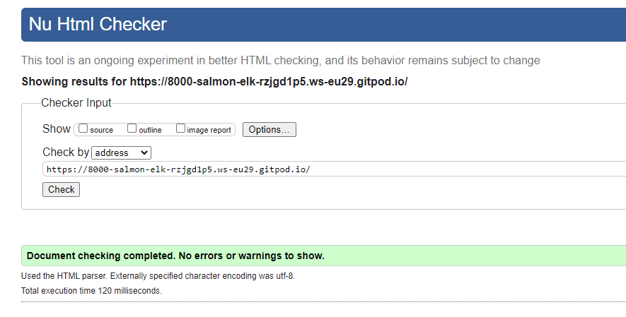

  
About 

  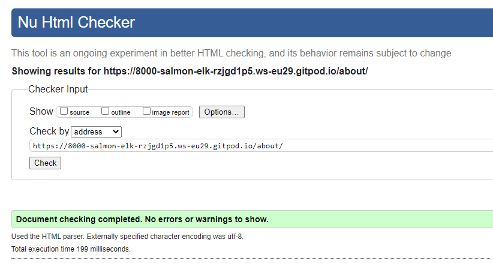

  
All products 

  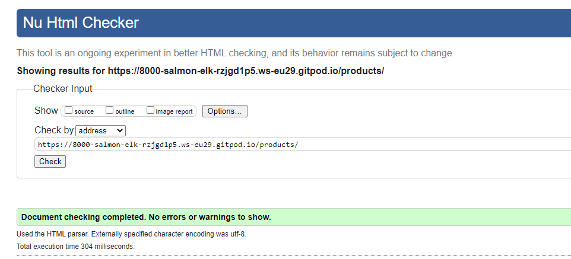

  
Product Details 

  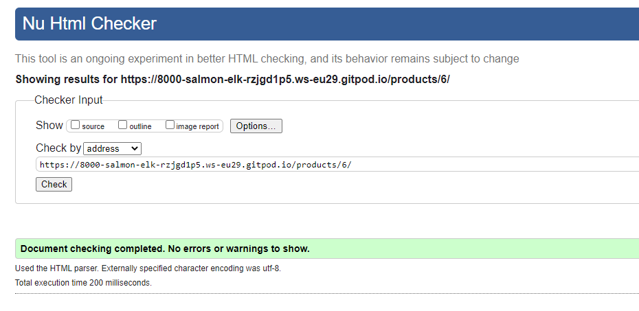

  
Blog 

  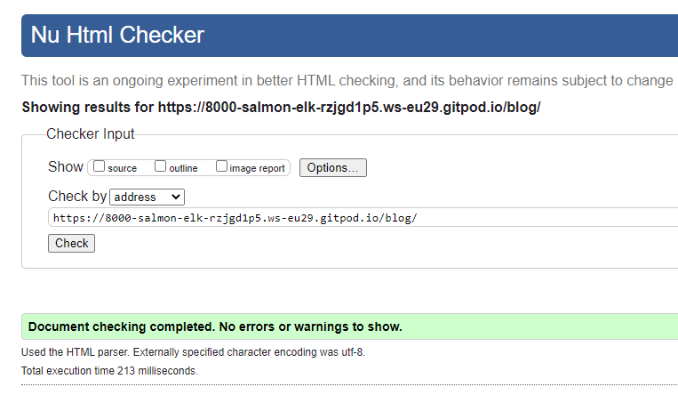

  
Login 

  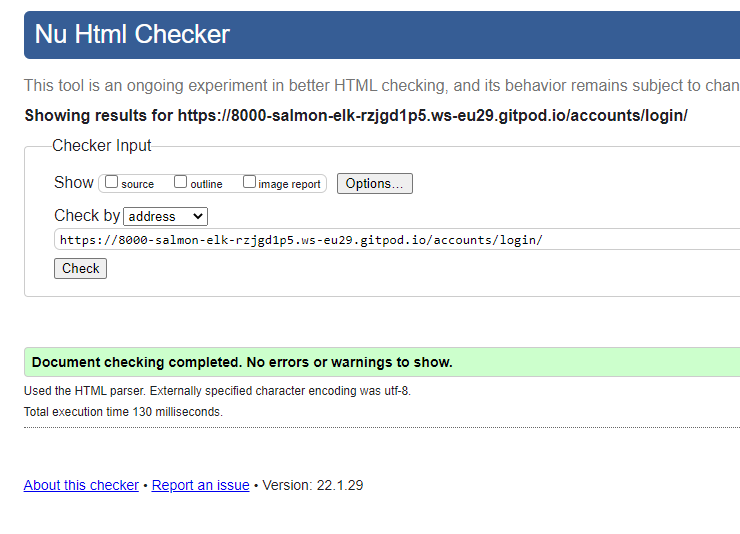

  
Register 

  

  
Checkout 

  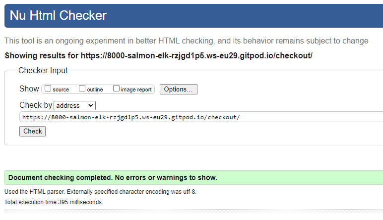

  
Checkout Success

  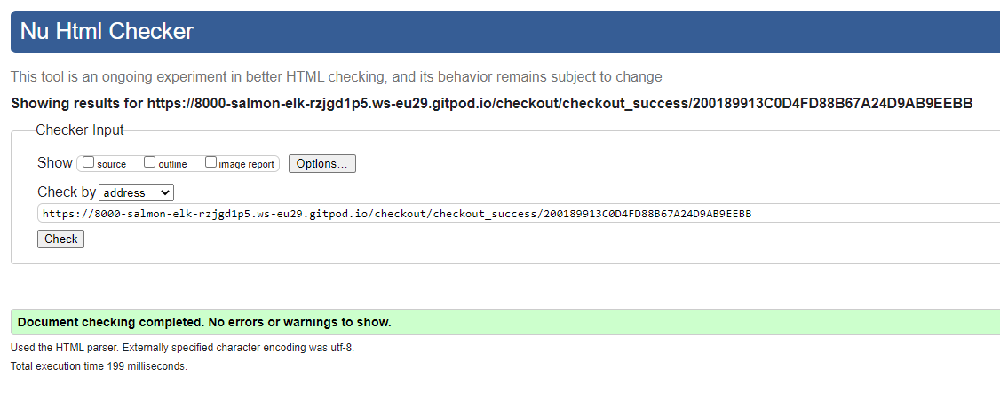

  
Bag

  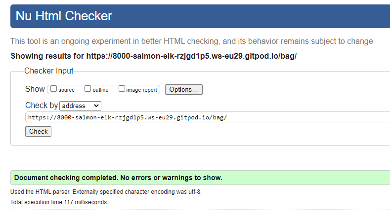

 

### W3C CSS Validation

CSS code is validated through [W3C Validator CSS](https://jigsaw.w3.org/css-validator/) - PASS

Results can be seen below.

  
Static/Base.css

  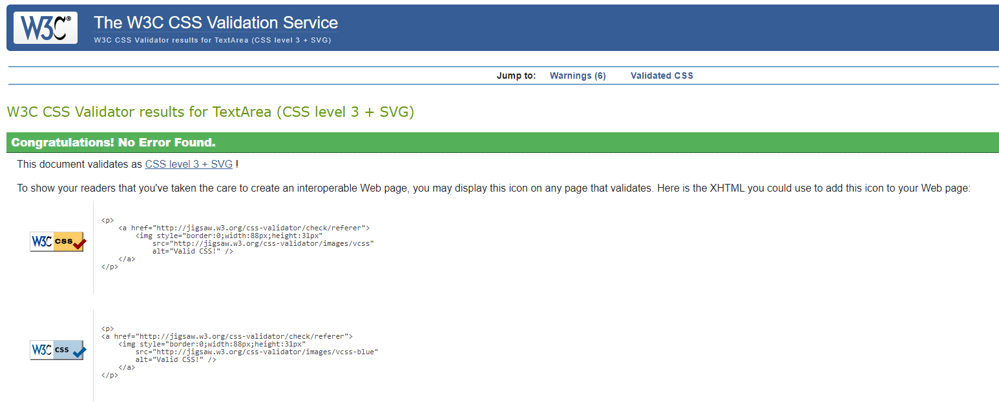

  
Profile.css 

  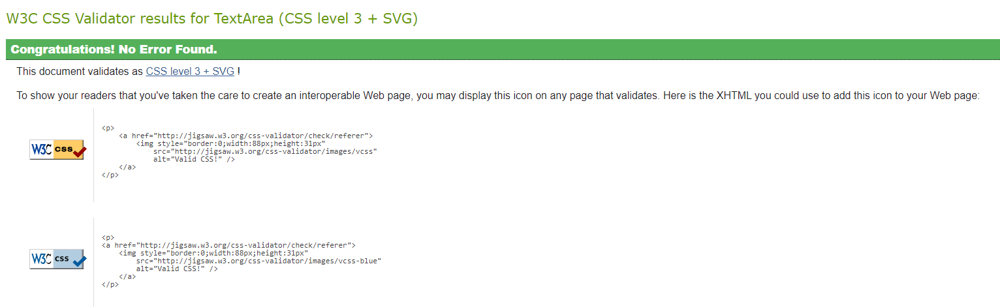

 

### JSHint

JavaScript code is validated through [JSHint](https://jshint.com/) - PASS

Files being tested: stripe_elements.js and countryfield.js in Profiles and Checkout templates.

Results can be seen below.

  
Stripe 

  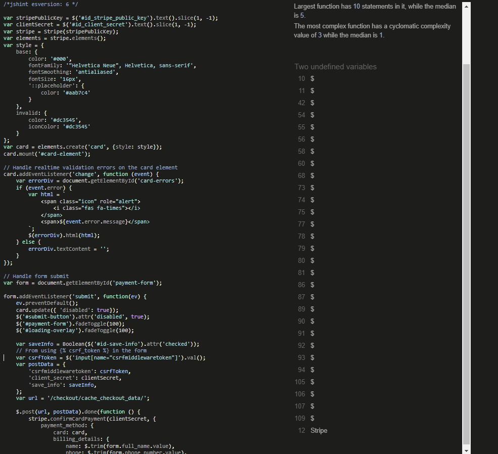

  
Countryfield 

  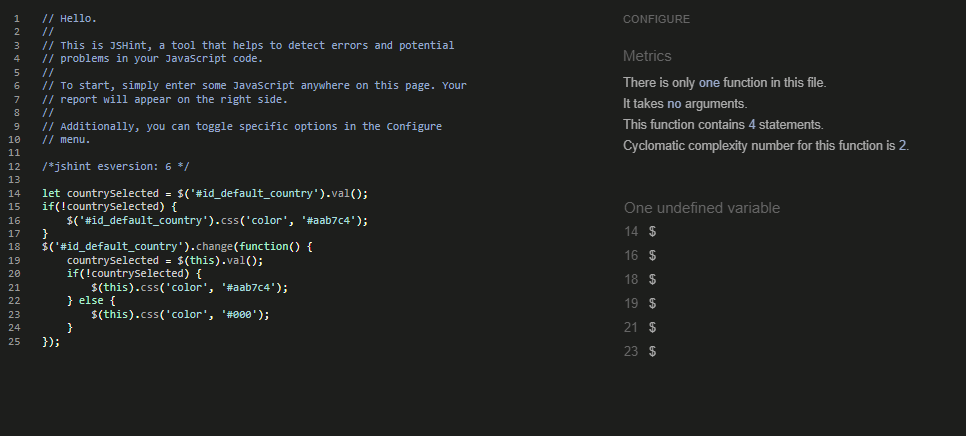

 

### PEP8 online check

Python code is validated through [PEP8](https://www.python.org/dev/peps/pep-0008/) 

Checked all Python files with through pep8online to check PEP8 compliance. With the exceptions listed below.

Installed flake8 to check errors in Python code. Warnings in auto generated files ignored. Edited line lengths, unused variables and other errors/warnings.
Files below showing the lines that did not pass as it would break the code (from checkout/models.py, checkout/webhooks.py, settings.py and products/views.py).

  
Checkout 

  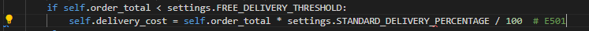

  
Product

  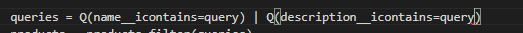

  
Settings 

  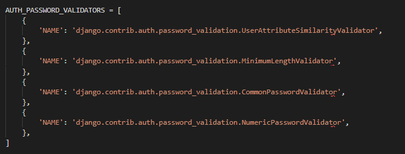

  
Webhook 

  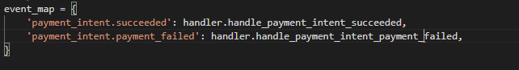

 

## Google Lighthouse

All pages passed through Lighthouse in Chrome DevTools:

 

  
Home

  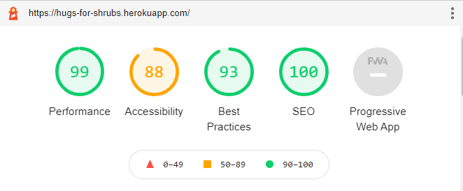

  
About 

  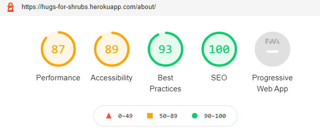

  
All products 

  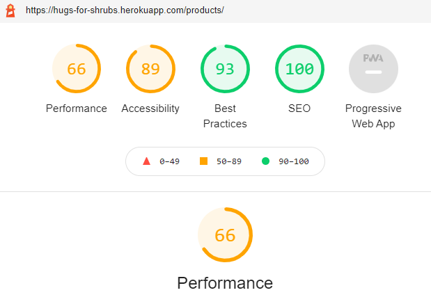

  
Product Details 

  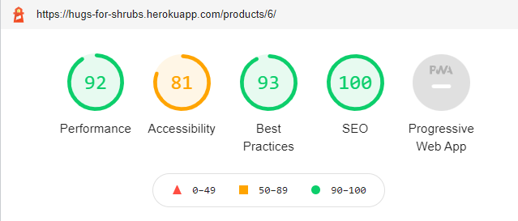

  
Blog 

  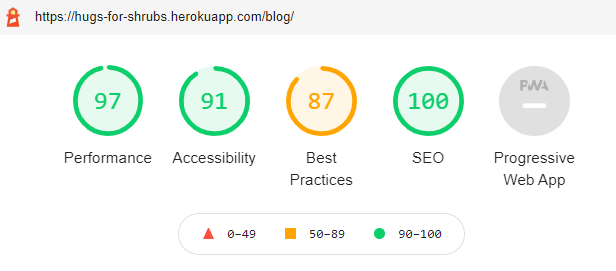

  
Login 

  

  
Register 

  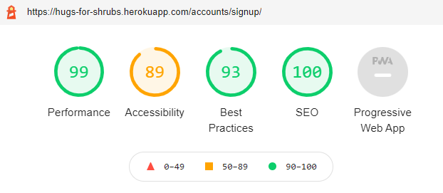

  
Checkout 

  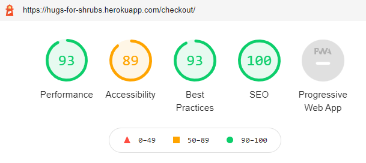

  
Checkout Success

  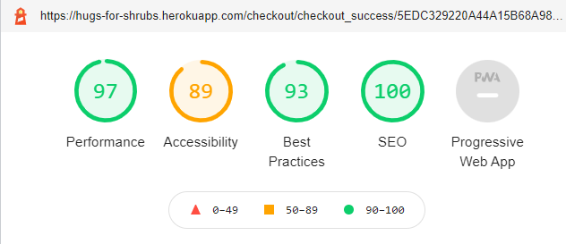

  
Bag

  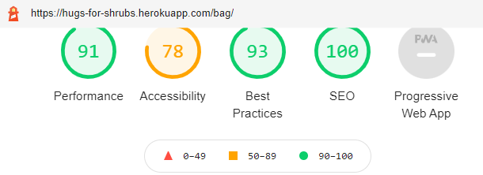

## Manual Testing

**Testing Environments**

Hugs For Shrubs app has been tested on Google Chrome, Internet Explorer, Microsoft Edge and Safari browsers (viewed at different desktop, laptop, tablet and mobile).

All links, required fields, buttons, sorting function, carousel, forms, blog posts, all drop-down menus, product display, product detail and search bar work as expected.

App has been reviewed by also by friends and family.

Code Institutes criteria checklist has been used to check requirements. 

[Back to top](#testing)

 

# Debugging 

## Issues and Bugs

### Bugs

Bugs identified during development and testing and their solutions are recorded [here](/readme-docs/hugsbugs.PNG).

### Known Issues

1. When a toast appears for something such as a user updating their profile the bag preview comes up also. With more time this bug could be coded out.
2. The back to top button overlies the footer on some pages on mobile and is a poor visual experience. With more time this could be improved.
3. There are still some issues with the position of the footer on some pages. Various fixes were tried for this including sticking it to the bottom of the page  (this blocked too much content on mobile devices), and using calculated values to create sufficient padding on the preceding element to accommodate the footer, and again this worked well for some pages but not for others, in particular the pages that incorporated allauth forms. In the end an empty div of fixed size was added to some of the pages to improve the position of the footer. It is not an ideal solution as the footer is too far down on some pages and not quite far enough on others and with more time a better solution could be worked out.
4. The emails to the user following an order aren't personalised. With more time this could be done.

[Back to top](#testing)